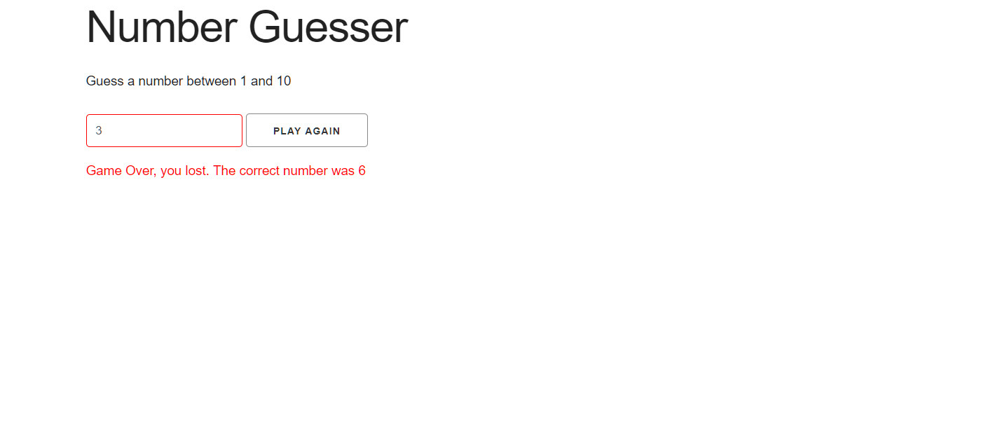
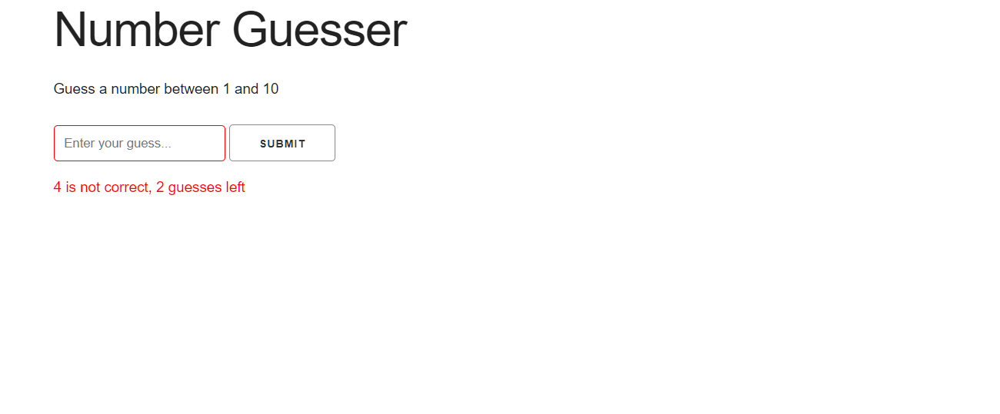

This Number Guesser app is built with Vanilla_JavaScript. UI of this app is done with Skeleton css. User have to guess a number from certain range which is set dynamically in this app, Range is 1-10 which can be changed with in the app. User will have 3 guesses and after that input filed will be disabled by the app. The amount of guesses can also be changed with in the app.

Input filed will be turned red in case of wrong guess and Green if the guess is right to give better usere experience.

The purpose of this app was to demonstrate the capability and power of Vanilla_Javascript in terms of functionality and how to render elements to DOM dynamically.

To run the project, Download or clone it on your machine and open index.html on your browser.

